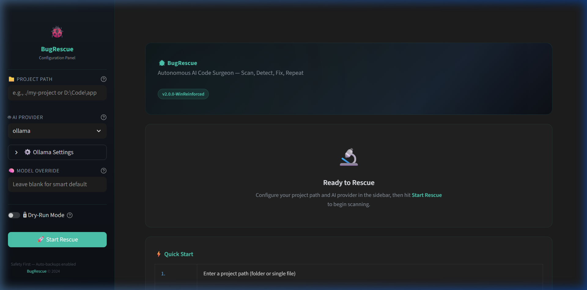

# 🐞 BugRescue

[](https://www.python.org/downloads/)
[](https://openai.com/)
[](https://www.docker.com/)

**BugFixere** is an autonomous AI-powered code repair assistant designed to scan project codebases, detect bugs, and automatically execute a self-correcting fix-loop. 

Featuring a **Hybrid Brain**, it lets you switch seamlessly between **local Ollama models** (perfect for privacy-centric offline development) and **cloud LLMs** (GPT-4o, Claude 3.5 Sonnet, Gemini Pro) for advanced reasoning.

---

## 🖥️ Streamlit Dashboard Preview

Here is the glassmorphism dark-mode UI designed for monitoring code health and managing repair pipelines:



---

## ⚡ Key Features

* **Auto-Fix Loop:** Automatically runs target project files, captures errors/exceptions, diagnoses issues, patches the code, and verifies the fix repeatedly until it works.
* **Hybrid Brain:** Effortlessly toggle between `ollama` (default), `openai`, `anthropic`, or `gemini` in real time.
* **Polyglot Repair:** Out-of-the-box support for Python, JavaScript, Go, Rust, C++, Java, and YAML.
* **Visual Web Dashboard:** A sleek, fully interactive Streamlit UI with live progress indicators, code diff viewers, and downloadable HTML reports.
* **Production-Ready Docker Setup:** Non-root execution, health checks, and a preconfigured local Ollama sidecar.
* **Safety First:** Auto-backups (`.bugrescue_backups/`) and a `--dry-run` auditing mode protect your repository files.

---

## 🚀 Quick Start

### 1. Clone & Install
Clone the repository to your local machine:
```bash
git clone https://github.com/Dhruvsoni4125/BugRescue.git
cd BugRescue
```

Create a virtual environment and install the dependencies:
```bash
python -m venv venv
# On Windows
.\venv\Scripts\activate
# On macOS/Linux
source venv/bin/activate

pip install -r requirements.txt
```

Set up your environment variables:
```bash
cp .env.example .env
# Open .env and fill in your Gemini, OpenAI, or Anthropic keys if using cloud models.
```

---

### 2. Run the Web Dashboard (Streamlit)
Launch the visual interface:
```bash
streamlit run app.py
```
*App will open automatically at `http://localhost:8501`.*

---

### 3. Run via CLI
To run BugRescue in your terminal, target a project directory or script:

#### A. Local/Offline Mode (Uses Ollama)
```bash
python bug_rescue.py ./my-project
```

#### B. Cloud Mode (Requires API keys in `.env`)
```bash
# Using Google Gemini
python bug_rescue.py ./my-project --provider gemini

# Using OpenAI GPT-4o
python bug_rescue.py ./my-project --provider openai

# Using Anthropic Claude
python bug_rescue.py ./my-project --provider anthropic
```

---

### 4. Run with Docker
BugRescue includes full Docker support for sandboxed runs.

```bash
# Build and run (using Cloud AI models)
docker compose up --build

# Build and run with a local Ollama service sidecar
docker compose --profile local up --build
```
The Docker container is configured to run securely as a non-root user and expose the Streamlit UI at `http://localhost:8501`.

---

## ⚙️ Configuration & Flags

### CLI Parameters
| Flag | Description | Default |
| :--- | :--- | :--- |
| `--provider` | Choose the AI provider: `ollama`, `openai`, `anthropic`, `gemini` | `ollama` |
| `--key` | Override API key for cloud models | `None` (looks up `.env`) |
| `--model` | Override default model (e.g. `gpt-4o`, `claude-3-5-sonnet-latest`, `gemini-1.5-flash`) | Smart default |
| `--dry-run` | Audits code bugs and reports them without writing changes | `False` |

### Environment Variables (.env)
* `OPENAI_API_KEY` - API key for OpenAI.
* `ANTHROPIC_API_KEY` - API key for Anthropic.
* `GEMINI_API_KEY` - API key for Google Gemini.
* `OLLAMA_URL` - Endpoint for the Ollama server (default: `http://localhost:11434/api/generate`).

---

## 🔒 Safety Guarantees
* **Auto-Backups:** Creates pre-patch snapshots inside `.bugrescue_backups/` so you can revert at any time.
* **Dry-Run Auditing:** Inspect proposed fixes in standard diff format before they are applied.
* **Privacy Controls:** Zero data is transmitted to the cloud when running with local Ollama.
* **Docker Isolation:** Secure containerization prevents external code execution from impacting your host system.

---

## 📄 License
This project is licensed under the MIT License - see the [LICENSE](LICENSE) file for details.
